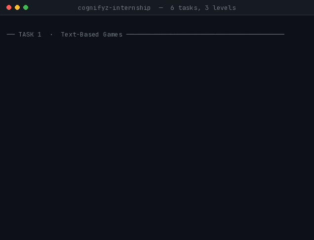

<div align="center">

# Cognifyz Technologies — Software Development Internship

**Arghya Mahajan** · B.Tech CSE (Cyber Security) · SRM Institute of Science & Technology


### Saare 6 tasks · teenon levels · har ek apne README ke saath



</div>

---

## 🚀 60 seconds mein shuru karo

```bash
git clone https://github.com/15Arghya2004/cognifyz-internship.git
cd cognifyz-internship
python task1_text_based_game/quiz_game.py
```

Tasks 1–5 ko **kuch install nahi karna** — sirf Python 3.6+. Sirf Task 6 ko libraries chahiye.

---

## 📋 Tasks

| # | Level | Project | Ek line mein |
|:-:|:-:|---|---|
| **1** | 🟢 Beginner | [Text-Based Games](task1_text_based_game/) | Number guessing + JSON se chalne wala quiz |
| **2** | 🟢 Beginner | [Number Patterns](task2_number_pattern/) | 8 patterns — spiral, magic square, Ulam prime spiral |
| **3** | 🟡 Intermediate | [Task Manager (CRUD)](task3_task_manager_crud/) | `Task` class ke saath poora CRUD |
| **4** | 🟡 Intermediate | [Health Temperature Toolkit](task4_temperature_converter/) | C↔F + fever, heat index, wind chill |
| **5** | 🔴 Advanced | [Persistent Manager + Reminders](task5_task_manager_persistent/) | JSON store + deadline briefing |
| **6** | 🔴 Advanced | [Interactive Web Scraper](task6_web_scraper/) | CLI + FastAPI + React dashboard |

Internship ke liye **4 tasks kaafi the.** Saare 6 kiye.

---

## 🔍 Har task kya karta hai

<details open>
<summary><b>🟢 Level 1 — Beginner</b></summary>

**Task 1 · Text-Based Games** — Do games. Number guessing `while` loop aur `try/except` sikhata hai. Quiz apne 30 sawaal ek **JSON file se** padhta hai — topic aur difficulty filter, har baar random 5 sawaal, aur high score file.

**Task 2 · Number Patterns** — Pyramid se aage. **Number spiral**, **magic square** (Siamese method), aur **Ulam prime spiral**. Har pattern **property se verify** kiya gaya, aankh se nahi — magic square ke saare row/column/diagonal sums barabar, spiral mein `1..n²` exactly ek baar.

</details>

<details open>
<summary><b>🟡 Level 2 — Intermediate</b></summary>

**Task 3 · Console Task Manager** — Pehla OOP task. Priority, due date, overdue detection, auto-sorting. README dikhata hai ki *parallel arrays problem* kya hai aur class use kaise theek karti hai.

**Task 4 · Health Temperature Toolkit** — PDF sirf C↔F maangta tha. Uske upar teen health tools bane: body temperature check jo **kahan se naapa** uske hisaab se adjust karta hai (bagal vs rectal), heat index (NOAA formula), wind chill (NWS). **Har clinical number cited hai** — Mayo Clinic, NIH StatPearls, NOAA, NWS.

</details>

<details open>
<summary><b>🔴 Level 3 — Advanced</b></summary>

**Task 5 · Persistent Manager + Reminders** — Task 3 ka app, ab `tasks.json` mein save hota hai. Khulte hi briefing: kya overdue hai, kya aaj due hai, aur **pichhli visit ke baad kya badla**. `--check` mode Windows Task Scheduler se roz apne aap chal sakta hai.

**Task 6 · Interactive Web Scraper** — Asli HTML scraping (`requests` + `BeautifulSoup`), ek FastAPI JSON layer, aur ek React dashboard. **Terminal developers ke liye, browser users ke liye.** HTTPS-only, domain allowlist, private-IP rejection, redirect validation, aur CSV/JSON/PDF export. 38 tests.

</details>

---

## ▶️ Chalane ke commands

```bash
# Level 1
python task1_text_based_game/guessing_game.py
python task1_text_based_game/quiz_game.py
python task2_number_pattern/pattern_generator.py

# Level 2
python task3_task_manager_crud/task_manager.py
python task4_temperature_converter/temperature_converter.py

# Level 3
python task5_task_manager_persistent/task_manager.py
python task5_task_manager_persistent/task_manager.py --check   # sirf reminder briefing
```

**Task 6** — dependencies chahiye:

```bash
pip install -r task6_web_scraper/requirements.txt

python task6_web_scraper/book_scraper.py        # terminal version
```

Browser dashboard ke liye (pehli baar `cd task6_web_scraper/frontend && npm install`):

```powershell
.\task6_web_scraper\run.ps1      # Windows
```

```bash
./task6_web_scraper/run.sh       # Linux / macOS
```

---

## ✅ Testing

Har task apne verification ke saath aaya, guess se nahi.

| Task | Checks | Kya verify hua |
|:-:|:-:|---|
| 2 | property-based | magic square sums, spiral completeness, prime counts |
| 3 | 44 | CRUD, overdue logic, ID reuse, date validation |
| 4 | 72 | known reference points, NWS chart cells, formula validity ranges |
| 5 | 110 | escaping, atomic writes, corrupt-file recovery, briefing engine |
| 6 | **38** | parsing, URL safety, redirect rejection, API contract, regressions |

Task 6 ka suite repo mein hai aur offline chalta hai:

```bash
python -m unittest discover -s task6_web_scraper/tests -v
# Ran 38 tests — OK
```

---

## 📁 Structure

```
cognifyz-internship/
├── README.md                    ← you are here
├── NOTES.md                     ← concepts learned, in my own words
├── assets/showreel.gif
│
├── task1_text_based_game/       README · guessing_game.py · quiz_game.py · questions.json
├── task2_number_pattern/        README · pattern_generator.py
├── task3_task_manager_crud/     README · task_manager.py
├── task4_temperature_converter/ README · temperature_converter.py
├── task5_task_manager_persistent/ README · task_manager.py
└── task6_web_scraper/           README · book_scraper.py · api.py · tests/ · frontend/
```

Har task folder mein apna **README + animated demos** hain.
`practice/` folders mein seekhte waqt likhe chhote scripts hain — jaan-boojh kar rakhe, wo dikhate hain final code tak kaise pahuncha.

Runtime files (`tasks.json`, `highscores.json`, `exports/`, `node_modules/`, `dist/`) `.gitignore` mein hain — wo generated data hai, source nahi.

---

<div align="center">

**Arghya Mahajan**
[GitHub](https://github.com/15Arghya2004) · [LinkedIn](https://www.linkedin.com/in/arghya-mahajan)

</div>
