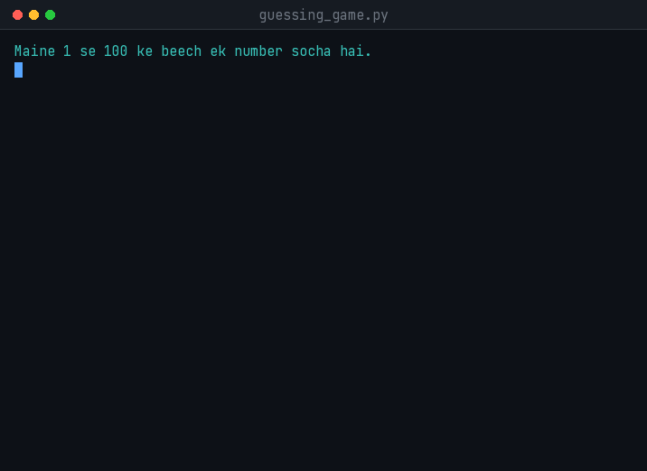
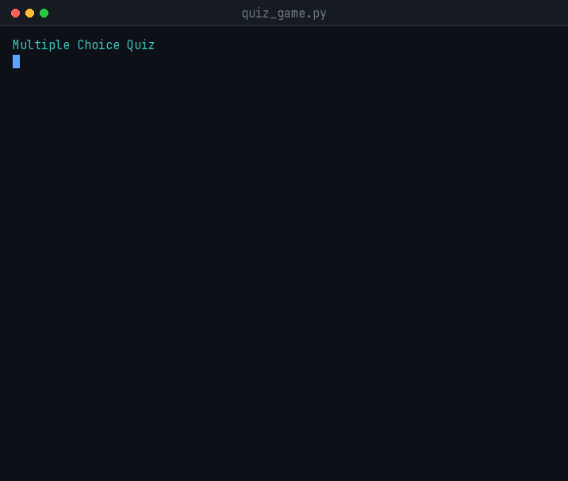

<div align="center">

# 🎮 Task 1 — Text-Based Games

**Two console games written in pure Python — a number guessing game and a data-driven quiz.**

[](https://www.python.org/)
[](#-quick-start)
[](#)
[](https://github.com/15Arghya2004/cognifyz-internship)

</div>

---

## 🚀 Quick Start

No installation. No `pip install`. No virtual environment. Just Python.

```bash
# 1. Clone the repository
git clone https://github.com/15Arghya2004/cognifyz-internship.git

# 2. Move into this task's folder
cd cognifyz-internship/task1_text_based_game

# 3. Run either game
python guessing_game.py
python quiz_game.py
```

> **Requirement:** Python 3.6 or above. Check with `python --version`.
> On some systems the command is `python3` instead of `python`.

---

## 🎯 The Games

| Game | What it is | Core idea |
|------|-----------|-----------|
| 🔢 **`guessing_game.py`** | Guess a secret number between 1 and 100 | `while` loop — rounds are unlimited until you win |
| ❓ **`quiz_game.py`** | 5 random multiple-choice questions, pick topic & difficulty | `for` loop — question count is fixed |

---

## 🔢 Number Guessing Game

<div align="center">
  
</div>

**How it works** — the computer picks a secret number between 1 and 100. You guess, and the game tells you whether your guess is higher or lower. When you win, it reports the number of attempts taken.

**What makes it robust**

- ✅ `hello`, `3.5`, an empty Enter — any input is handled and the game **never crashes**
- ✅ Entering `150` or `-5` prints an "out of range" message, and the attempt is **not counted**
- ✅ In the demo above, nine inputs were entered but the final score correctly reports **seven attempts**

```bash
python guessing_game.py
```

---

## ❓ Quiz Game

<div align="center">
  
</div>

**How it works** — pick a topic, pick a difficulty, and answer five randomly selected questions. Each correct answer scores one point. At the end you see the score, percentage, and the high score for that combination.

**What makes it robust**

- 🎲 **Every game is different** — five questions are drawn from a bank of thirty, without repeats
- 🏷️ **Topic filter** — Python / General Knowledge / All
- 📊 **Difficulty filter** — easy / medium / hard / All
- 🏆 **High score** — the best score for each topic + difficulty combination is persisted
- 📝 **Questions live in a separate file** — new quizzes can be authored without touching Python
- ✅ Invalid input (`Z`, `hello`, empty) does **not** skip the question — the prompt is repeated

```bash
python quiz_game.py
```

---

## 📝 Adding Your Own Questions

Questions live in `questions.json` — **not inside the Python source**. To create a new quiz, edit this file: adding or replacing questions requires no code changes.

```json
{
  "name": "My question bank",
  "version": 1,
  "questions": [
    {
      "id": "net-e-01",
      "topic": "Networking",
      "difficulty": "easy",
      "question": "Which port does HTTP use by default?",
      "options": { "A": "21", "B": "80", "C": "443", "D": "22" },
      "answer": "B"
    }
  ]
}
```

**Each question requires these six fields:**

| Field | Meaning |
|-------|---------|
| `id` | Unique identifier such as `net-e-01` |
| `topic` | Any topic — it appears in the menu automatically |
| `difficulty` | `easy` / `medium` / `hard` (or any label you choose) |
| `question` | The question text |
| `options` | Exactly four — `A`, `B`, `C`, `D` |
| `answer` | The letter of the correct option |

> 💡 Add a new topic and it will **appear in the menu on its own** — no code change required.
> The menu is derived from the question bank; nothing is hard-coded.
>
> ⚠️ If a question is malformed, the game does not crash — that specific question is skipped and the rest of the game runs normally.

**Bundled bank:** 30 questions — 2 topics × 3 difficulty levels × 5 questions each.

---

## 📂 Files

```
task1_text_based_game/
├── guessing_game.py     # Game 1
├── quiz_game.py         # Game 2
├── questions.json       # Quiz question bank (data)
├── highscores.json      # Created at runtime (git-ignored)
├── assets/              # README demo GIFs
└── practice/            # Small scripts written while learning
    ├── demo1_def_vs_call.py
    └── demo2_secret_dikhao.py
```

---

<details>
<summary><h2>📋 Internship Requirement (click to expand)</h2></summary>

From the internship task document:

> Develop a simple text-based game, such as a quiz or a guessing game.
> Define the game rules, use conditional statements to control the game flow,
> then test and debug the program for correctness.

Both games satisfy the requirement independently.

| File | Game | Main concept |
|------|------|--------------|
| `guessing_game.py` | Number guessing (1–100) | `while` loop — unknown number of rounds |
| `quiz_game.py` | Multiple-choice quiz, data-driven | `for` loop — fixed number of questions |

</details>

<details>
<summary><h2>🧪 Test Cases (click to expand)</h2></summary>

### Guessing game

| Input | Expected behaviour | Reason |
|-------|--------------------|--------|
| `50` | "too low" or "too high" | Normal path |
| `hello` | Error message, re-prompt | `ValueError` caught |
| `3.5` | Error message, re-prompt | `int()` rejects decimal strings |
| `150` | "out of range", attempt NOT counted | Range check runs before the counter |
| `-5` | "out of range" | `guess < 1` is true |
| *(empty Enter)* | Error message | Empty string is not an integer |

### Quiz game

| Input / condition | Expected behaviour | Reason |
|-------------------|--------------------|--------|
| `B` | Accepted, scored | Normal path |
| `b` / `  b  ` | Accepted, scored | `.upper()` and `.strip()` normalise the input |
| `Z`, `hello`, *(empty)* | Error message, re-prompt | Not in `("A","B","C","D")` |
| Menu input `0`, `99`, `abc` | Error message, re-prompt | Range check plus `int()` conversion |
| Two runs, same filter | Different question order/set | `random.sample()` per game |
| `questions.json` missing | Clear message, no traceback | `FileNotFoundError` handled |
| `questions.json` malformed | Message with the parse error | `json.JSONDecodeError` handled |
| A question missing `answer` | That question is skipped, game continues | Validated on load |
| Filter matches fewer than 5 | Plays with what exists, reports the count | Guard before `random.sample()` |

Verified: across 200 simulated selections no game contained a duplicate question.
All 14 Python questions in the bank were validated by executing the expressions they refer to.

</details>

<details>
<summary><h2>🐛 Bugs Found and Fixed (click to expand)</h2></summary>

**Bug 1 — type mismatch.** `input()` always returns a **string**, never a number.
The first version compared the raw string against the secret integer, which raises:

```
TypeError: '<' not supported between instances of 'str' and 'int'
```

Fixed by converting with `int()`, and wrapping that conversion in `try/except ValueError` so non-numeric input is handled instead of crashing.

**Bug 2 — attempt counter in the wrong place.** The counter was originally incremented *before* the range check, so out-of-range input inflated the attempt count without being a real guess. Moving `attempts += 1` to after the `continue` fixed it. Verified: a run with six inputs, three of them invalid, reported three attempts.

The second bug did not crash anything — it just produced a wrong number. Those are the harder ones to notice.

</details>

<details>
<summary><h2>🏗️ Design Notes (click to expand)</h2></summary>

### Why a `for` loop here and a `while` loop there

This is the main reason both games exist in this task.

| | `guessing_game.py` | `quiz_game.py` |
|---|---|---|
| Loop | `while True` | `for item in selected` |
| Reason | The number of rounds is unknown until the player wins | The number of questions is fixed at 5 |

Rule of thumb: when the number of repetitions is known in advance, use `for`; when it depends on a condition, use `while`.

### Questions are data, not code

Storing the questions in a JSON file rather than a Python list means the program never has to change when the content changes. `total = len(selected)` adjusts automatically, and the menus are derived from the file rather than hard-coded, so the data file remains the single source of truth.

### `random.sample()` rather than `random.choice()`

`random.choice()` picks from the whole pool each time, so calling it five times can return the same question twice. `random.sample()` draws without replacement, which is what a quiz needs. Because `random.sample()` raises `ValueError` when asked for more items than the pool holds, the pool size is checked first and a shuffled copy is used when the filter matches fewer than five questions.

### Input validation — two different tools, on purpose

The answer prompt only needs a membership test, because the set of valid answers is known up front:

```python
choice = raw.strip().upper()
if choice in VALID_CHOICES:
    return choice
```

The menu prompt also has to convert text to a number, and that conversion can fail, so it needs both:

```python
try:
    picked = int(raw)             # Python's rule: can this text become a number?
except ValueError:
    ...
if 1 <= picked <= len(choices):   # our rule: is it a valid menu position?
    ...
```

Use `if` when the rule can be checked in advance; use `try/except` when the only way to know is to attempt the operation.

### File paths

Both data files are resolved relative to the script's own location:

```python
HERE = Path(__file__).parent
QUESTIONS_FILE = HERE / "questions.json"
```

This means the game can be launched from any working directory, not just from inside `task1_text_based_game/`.

</details>

---

<div align="center">

**Part of the [Cognifyz Software Development Internship](https://github.com/15Arghya2004/cognifyz-internship)**
Built by [Arghya Mahajan](https://github.com/15Arghya2004)

</div>
