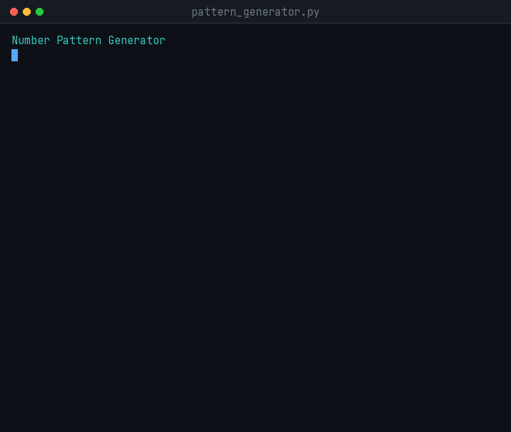
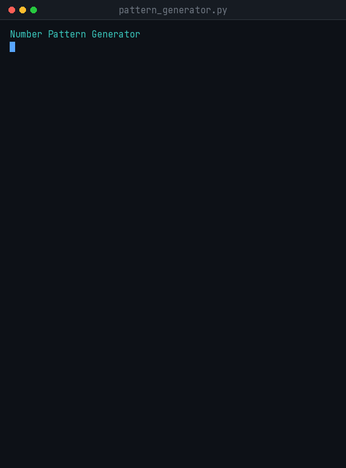

<div align="center">

# 🔺 Task 2 — Number Pattern Generator

**Eight number patterns, from simple nested loops to spiral algorithms and magic squares.**

[](https://www.python.org/)
[](#-quick-start)
[](#-the-patterns)
[](#)

</div>

---

## 🚀 Quick Start

```bash
cd cognifyz-internship/task2_number_pattern
python pattern_generator.py
```

No installation. No dependencies. Python 3.6 or above.

Program pattern ka menu dikhayega → aap ek chuno → size do → pattern ban jayega.

---

## ⭐ The Interesting Three

### 🌀 Number Spiral

Numbers `1` se `n×n` tak, bahar se andar ghoomte hue.

<div align="center"></div>

Ye **nested loop se ban hi nahi sakta** — kyunki direction badalti rehti hai.
Iske liye ek *direction vector* chahiye jo deewar aane pe 90° mud jaye:

```python
dr, dc = 0, 1                # (0,1)=right  (1,0)=down  (0,-1)=left  (-1,0)=up
...
if blocked:
    dr, dc = dc, -dr         # ek line mein 90 degree turn
```

---

### 🔮 Magic Square

Har row, har column aur **dono diagonals** ka jod barabar aata hai.

<div align="center"></div>

Ye *Siamese method* se banta hai — `1` ko top row ke beech mein rakho, phir har agla number
upar-daayen. Grid se bahar nikal jao to doosri taraf se ghus jao (modulo), aur cell bhara ho
to ek neeche aa jao.

```python
nr, nc = (r - 1) % n, (c + 1) % n     # upar-daayen, wrap around
if grid[nr][nc] != 0:
    nr, nc = (r + 1) % n, c           # bhara hai -> neeche
```

> 💡 Is pattern ki khaas baat: iska output **prove kiya ja sakta hai**. Sirf "dekhne mein sahi
> lag raha hai" nahi — `n=11` pe 24 alag sums nikalte hain aur sab exactly `671` aate hain.

---

### 🔢 Ulam Prime Spiral

Numbers spiral mein rakho, sirf **prime numbers** mark karo — aur diagonal lines apne aap ban jati hain.

<div align="center"></div>

Aisa **kyun** hota hai — aaj tak koi nahi jaanta. Stanisław Ulam ne 1963 mein ek boring meeting
mein doodle karte hue notice kiya tha. Ye maths ka ek **unsolved problem** hai.

---

## 🔺 The Patterns

Simple se complex tak, teen levels mein:

| # | Pattern | Size | Idea |
|---|---------|------|------|
| 1 | **Pyramid** | 1–15 | Nested loop + leading spaces |
| 2 | **Floyd's triangle** | 1–12 | Counter jo rows ke beech reset nahi hota |
| 3 | **Palindrome pyramid** | 1–12 | Do inner loops — upar chadho, wapas utro |
| 4 | **Concentric rings** | 2–9 | Value **distance se** nikalti hai, counting se nahi |
| 5 | **Multiplication grid** | 2–12 | Asli pahada table, headers ke saath |
| 6 | **Number spiral** | 2–12 | Direction vector + boundary check |
| 7 | **Magic square** | 3–11 *(odd)* | Siamese method, modulo wrap |
| 8 | **Ulam prime spiral** | 5–25 *(odd)* | Spiral + primality test |

<details>
<summary><b>Sample output dekho (click)</b></summary>

```
Palindrome pyramid (n=5)        Concentric rings (n=4)
        1                       4 4 4 4 4 4 4
      1 2 1                     4 3 3 3 3 3 4
    1 2 3 2 1                   4 3 2 2 2 3 4
  1 2 3 4 3 2 1                 4 3 2 1 2 3 4
1 2 3 4 5 4 3 2 1               4 3 2 2 2 3 4
                                4 3 3 3 3 3 4
Floyd's triangle (n=5)          4 4 4 4 4 4 4
1
2 3                             Number spiral (n=5)
4 5 6                             1  2  3  4  5
7 8 9 10                         16 17 18 19  6
11 12 13 14 15                   15 24 25 20  7
                                 14 23 22 21  8
                                 13 12 11 10  9
```

</details>

---

## ➕ Naya Pattern Add Karna

Do step:

**1.** Function likho jo `n` leta hai aur print karta hai:

```python
def my_pattern(n):
    for row in range(1, n + 1):
        for col in range(1, row + 1):
            print(col, end=" ")
        print()
```

**2.** `PATTERNS` mein entry jodo — apne size rules ke saath:

```python
PATTERNS = {
    ...
    "My pattern": {"fn": my_pattern, "min": 1, "max": 15, "odd": False},
}
```

Menu apne aap update ho jayega. `ask_size()` bhi aapke `min`/`max`/`odd` rules **khud** padh lega.
Koi `if/elif` chain nahi.

> 💡 Dictionary mein `my_pattern` likha hai, `my_pattern()` **nahi**. Bracket lagane se function
> *chal* jata hai; bina bracket ke wo ek *cheez* ban jata hai jise baad mein chalaya ja sakta hai.
> Isiliye `spec["fn"](size)` kaam karta hai.

---

<details>
<summary><h2>📋 Internship Requirement (click to expand)</h2></summary>

From the internship task document:

> Create a program that generates and prints a number pattern using loops.
> Allow the pattern type to be selected, generate the pattern, and verify
> that the output is correct.

| Requirement | Where it is met |
|---|---|
| Generates and prints a number pattern | Eight pattern functions |
| Using loops | Every pattern uses nested loops; three go further with direction logic |
| Pattern type can be selected | Menu built from the `PATTERNS` registry |
| Output verified as correct | Property-based tests, see below |

</details>

<details>
<summary><h2>🧪 Test Results (click to expand)</h2></summary>

Output ko "dekh ke sahi lag raha hai" se verify nahi kiya — har pattern ki **asli property**
check ki gayi hai.

### Magic square — 1..n² present, aur saare sums barabar

| n | Sums checked | Every sum equals | 1..n² all present | Result |
|---|---|---|---|---|
| 3 | 8 | 15 | yes | PASS |
| 5 | 12 | 65 | yes | PASS |
| 7 | 16 | 175 | yes | PASS |
| 9 | 20 | 369 | yes | PASS |
| 11 | 24 | 671 | yes | PASS |

*(n rows + n columns + 2 diagonals)*

### Number spiral — har cell exactly ek baar

| n | Check | Result |
|---|---|---|
| 2, 3, 5, 8, 12 | Flattened grid equals `1..n²` exactly once | PASS |

Ye test spiral ke chhootne aur dobara likhne — dono ko pakad leta.

### Ulam spiral — `#` sirf primes pe

| n | `#` count | Primes ≤ n² | Result |
|---|---|---|---|
| 5 | 9 | 9 | PASS |
| 9 | 22 | 22 | PASS |
| 17 | 61 | 61 | PASS |
| 25 | 114 | 114 | PASS |

`is_prime()` ko alag se pehle 22 primes (2–79) se compare kiya — PASS.

### Baaki

| Pattern | Check | Result |
|---|---|---|
| Palindrome pyramid | Har row `row == row[::-1]`, aur exactly n rows | PASS |
| Concentric rings | Grid `(2n-1)²`, centre = 1, corner = n | PASS |
| **All 8** | Apne `min` size pe chalte hain, koi crash nahi | PASS |

### Input validation

| Input | Kahan | Behaviour |
|-------|-------|-----------|
| `abc`, *(khali)* | Dono prompts | "Sirf number likho", dobara poochta hai |
| `0`, `99` | Pattern menu | "1 se 8 ke beech likho" |
| `0`, `-5`, `500` | Size prompt | Pattern ke apne range ka message |
| `4` | Magic square size | "Odd number chahiye. Try 5 ya 3." |

</details>

<details>
<summary><h2>🏗️ Design Notes (click to expand)</h2></summary>

### Nested loops — is task ka core

```python
for row in range(1, n + 1):        # outer: kitni lines
    for col in range(1, row + 1):  # inner: is line pe kitne number
        print(col, end=" ")
    print()                        # line khatam
```

Outer loop ek baar ghoomta hai to inner **poora** ghoom jata hai. Inner loop ki limit `row` pe
depend karti hai — isiliye har line pichhli se lambi hoti hai.

`print(..., end=" ")` normal newline ko rok deta hai, isliye numbers ek line mein rehte hain.
Inner loop ke baad khali `print()` line todta hai.

### Jahan nested loop kaafi nahi padta

Spiral aur Ulam mein rows aur columns ka simple relation hai hi nahi — position **direction** se
badalti hai. Iske liye chahiye:

- Ek 2D grid jisme likha ja sake — `[[0] * n for _ in range(n)]`
- Direction vector `(dr, dc)` aur ek turn rule — `dr, dc = dc, -dr`
- Boundary aur "already filled" check

Magic square mein modulo se wrap-around hota hai — `(r - 1) % n` — taaki grid ke bahar jaane pe
doosri taraf se entry mile.

### Har pattern apne rules khud carry karta hai

```python
PATTERNS = {
    "Magic square": {"fn": magic_square, "min": 3, "max": 11, "odd": True},
}
```

`ask_size()` ye rules **spec se padhta hai**, hardcode nahi karta. Isliye "magic square sirf odd
pe chalta hai" wali baat sirf **ek jagah** likhi hai — us pattern ki entry mein. Naya pattern
apne alag rules ke saath aa sakta hai, aur `ask_size()` badalna nahi padega.

Ye Task 1 ke `questions.json` wali hi soch hai — **data alag, logic alag**.

### Task 1 se reuse

`ask_choice()` bilkul wahi function hai jo `quiz_game.py` mein hai. `ask_size()` `get_guess()`
ke shape pe bana hai: `try/except ValueError` conversion ke liye, phir `if` apne rules ke liye.

Use `try/except` when the only way to know is to attempt the operation; use `if` when the rule
can be checked in advance.

### Size caps

Har pattern ka apna max hai. Ulam 25 tak jata hai (pattern dikhne ke liye jagah chahiye), magic
square 11 tak (uske aage columns tedhe lagne lagte hain), Floyd 12 tak (numbers 78 tak pahunch
jaate hain). Ye usability decisions hain, `PATTERNS` mein data ki tarah rakhe hue.

</details>

---

<div align="center">

**Part of the [Cognifyz Software Development Internship](https://github.com/15Arghya2004/cognifyz-internship)**
Built by [Arghya Mahajan](https://github.com/15Arghya2004)

</div>
