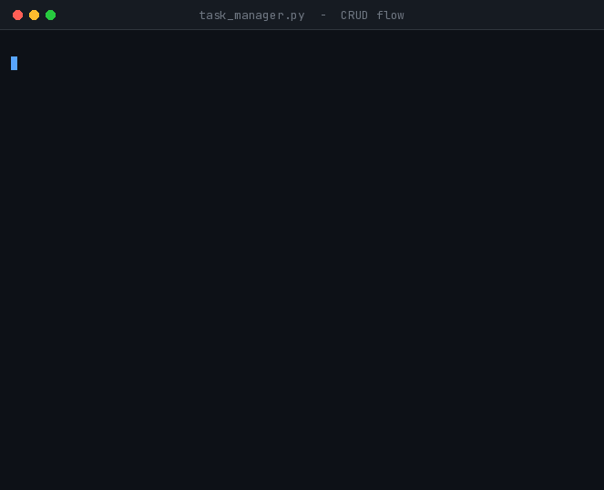
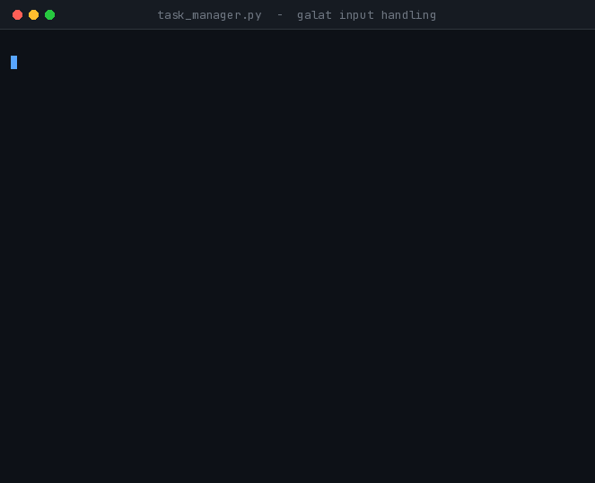

<div align="center">

# 📝 Task 3 — Console Task Manager

**Cognifyz Technologies · Software Development Internship · Level 2**


A terminal-based to-do manager.
**Create**, **read**, **update**, and **delete** tasks.

</div>

---

## 🚀 Run

```bash
python task3_task_manager_crud/task_manager.py
```

That is all. No installation, no setup — Python 3.6 or above is the only requirement.

---

## 🎬 What it looks like

<div align="center">



*Two tasks created → table view → one marked done → another deleted*

</div>

---

## 📋 Menu

```
====================================================
  TASK MANAGER  -  Cognifyz Internship Task 3
====================================================
  1. Create a new task
  2. View tasks (Read)
  3. Update a task
  4. Mark a task as done
  5. Delete a task
  0. Exit
```

| Key | Action |
|:---:|---|
| `1` | Prompts for title, description, priority and due date |
| `2` | Lists all tasks in a table, with All / Pending / Done / Overdue filters |
| `3` | Select a task, then edit only the fields you want to change |
| `4` | Marks the task as complete |
| `5` | Delete — shows details first, then asks for confirmation |
| `0` | Quit |

---

## 📦 Fields on each task

| Field | Description | Example |
|---|---|---|
| `id` | Assigned automatically | `1` |
| `title` | Task name — **required** | `Submit internship Task 3` |
| `description` | Extra detail — optional | `Prepare the README and push` |
| `priority` | High / Medium / Low | `High` |
| `status` | pending / done | `pending` |
| `due_date` | Deadline — optional | `2026-08-22` |
| `created_at` | Recorded automatically | `2026-08-19 21:17:24` |

The table sorts itself:

> **pending first → then High priority → then earliest due date**

Any task past its due date is flagged **`OVERDUE`** in red.

---

## 🛡️ What happens on invalid input

The program **never crashes**. Every mistake is reported clearly and the prompt is repeated.

<div align="center">



*Menu entry `9`, priority `Urgent`, date `25-08-2026`, ID `99` — all handled gracefully*

</div>

---

## 🧠 Three core ideas in the code

### 1. One task = one object

The old approach — three parallel lists:

```python
titles     = ["Go to the gym", "Study Python"]
priorities = ["Medium", "High"]
statuses   = ["done", "pending"]
```

Deleting index 0 must be done in **all three** lists. Forget one and the data silently drifts.

The new approach — everything on a `Task` object:

```python
class Task:
    def __init__(self, task_id, title, description="", priority="Medium",
                 due_date=None, status="pending", created_at=None):
        self.id = task_id
        self.title = title
        ...
```

Now there is a single list — `tasks = [Task, Task, Task]`. Deleting a task removes it whole.

### 2. IDs never repeat

```python
def next_id(tasks):
    if not tasks:
        return 1
    return max(task.id for task in tasks) + 1
```

Using `len(tasks) + 1` would be wrong. With three tasks, delete the middle one, and `len` becomes 2, so the next new id would be 3 — already in use. `max + 1` prevents this by construction.

### 3. Two flavours of validation

```python
try:
    return int(raw)          # int()'s rule is a PYTHON rule
except ValueError:
    print("  -> Enter a number, for example 3.")
```

```python
if raw.lower() in lowered:   # High/Medium/Low is OUR rule
    return lowered[raw.lower()]
```

> **Our rule → use `if`. Python's rule → use `try / except`.**

---

## 🔗 Relationship to Task 5

Task 5 extends this application with **file-backed persistence**. Two methods are already prepared for that:

```python
task.to_dict()          # object     -> dictionary  (for writing to a file)
Task.from_dict(data)    # dictionary -> object      (for reading it back)
```

They are unused in Task 3. Task 5 only adds save / load — the `Task` class itself does not need to change.

---

<details>
<summary><b>🧪 Testing — 44/44 checks pass (click to expand)</b></summary>

Step 6 of the task brief says *"Test the application with various scenarios."*

**Automated checks:**

| Check | Result |
|---|:---:|
| New tasks are `pending` with priority `Medium` | ✅ |
| A done task is never displayed as `OVERDUE` | ✅ |
| Today's due date is not `OVERDUE` (it becomes overdue tomorrow) | ✅ |
| Deleting a middle task does not reuse its ID | ✅ |
| `to_dict` → `from_dict` preserves all seven fields | ✅ |
| Reconstruction works from a partial dictionary | ✅ |
| Sort order: pending + High + earliest due date at the top | ✅ |
| `25-08-2026`, `2026/08/25`, `hello`, `2026-13-01`, `2026-02-30` all rejected | ✅ |
| Long title truncated, empty table does not crash | ✅ |

**Manual scenarios:**

- Menu entry `9` → *"Enter an option between 0 and 5"*, program continues
- Due date `25-08-2026` → format error, re-prompt
- Update using ID `99` → *"No task found with ID 99"*, returns to menu
- Empty due date → task created without a due date
- Delete confirmation with `n` → cancelled, task retained
- Delete every task then View → *"list is empty"*, no crash

</details>

<details>
<summary><b>⚙️ Design decisions</b></summary>

- **`tasks` is passed as an argument rather than a global** — globals make testing awkward and would complicate the Task 5 load path.
- **`datetime.strptime` instead of `date.fromisoformat`** — `fromisoformat` is Python 3.7+; `strptime` runs on 3.6, so the README's "3.6+" claim remains accurate.
- **A deleted ID is never re-issued** — otherwise old screenshots or notes could silently point at an unrelated task.
- **`__repr__` is defined** — without it, `print(task)` shows a memory address, which is useless while debugging.
- **`sorted()` used, not `list.sort()`** — `sorted()` returns a new list, keeping the caller's ordering intact.

</details>

<details>
<summary><b>⚠️ A deliberate limitation</b></summary>

**Data is not persisted.** Close the program and the tasks are gone.

This is not a bug — it matches the Task 3 brief: *"using arrays or lists for data storage"*. **Task 5** removes this limitation by adding file I/O.

</details>

---

## 📁 Files

```
task3_task_manager_crud/
├── README.md
├── task_manager.py            <- the whole program
└── assets/
    ├── crud_demo.gif
    └── validation_demo.gif
```

<div align="center">

**Arghya Mahajan** · [github.com/15Arghya2004](https://github.com/15Arghya2004)

</div>
