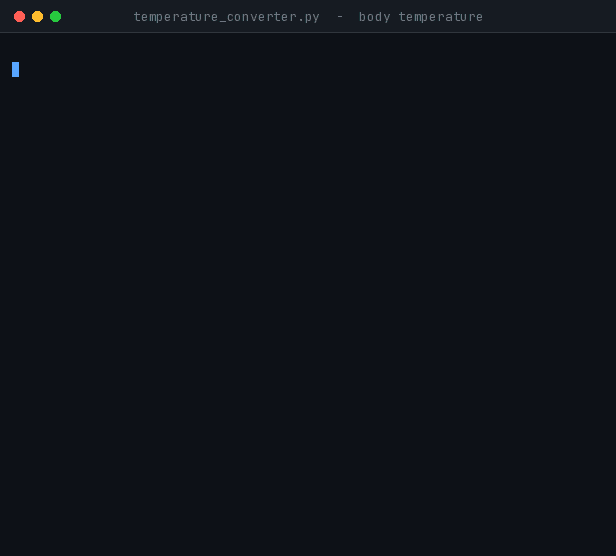
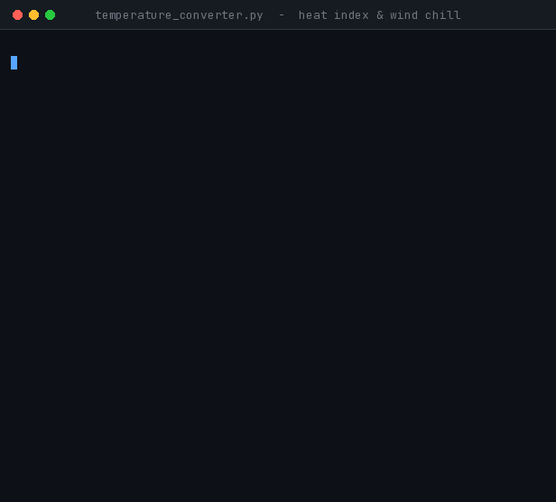

<div align="center">

# 🌡️ Task 4 — Health Temperature Toolkit

**Cognifyz Technologies · Software Development Internship · Level 2**


Convert temperatures — **and explain what the numbers actually mean.**

</div>

> ⚠️ **This is not a medical device.** The program shows public reference ranges only.
> Any health decision should be taken with a qualified doctor.

---

## 🚀 Run

```bash
python task4_temperature_converter/temperature_converter.py
```

That is all. No installation, no setup — Python 3.6 or above is the only requirement.

---

## 📋 Menu

```
==========================================================
  HEALTH TEMPERATURE TOOLKIT  -  Cognifyz Task 4
==========================================================
  1. Convert Celsius <-> Fahrenheit
  2. Body temperature check
  3. Heat index — how hot it feels
  4. Wind chill — how cold it feels
  5. Reference tables
  0. Exit
```

**Option 1 covers the task brief on its own** — the user enters a temperature, chooses a direction, and gets the conversion. Options 2–5 are health tools layered on top.

---

## 🩺 Body temperature check

<div align="center">



*Armpit reading of 37.3 °C → equivalent oral 37.6–37.9 °C → straddles two bands. Then a 103 °F oral reading → High fever.*

</div>

The program asks three things: **reading**, **measurement site**, and **who the reading is for**.

### Why the measurement site matters

The same core temperature reads differently depending on where it is taken:

| Site | Difference from oral |
|---|---|
| Rectal | 0.3 – 0.6 °C **higher** |
| Ear | 0.3 – 0.6 °C **higher** |
| Armpit | 0.3 – 0.6 °C **lower** |
| Forehead | 0.3 – 0.6 °C **lower** |

The program therefore converts the reading to an **oral-equivalent** first, and only then reports a category.

> **A conscious design choice:** the source gives a **range** (0.3 to 0.6), not a fixed number. The program keeps that range in its output rather than inventing precision that does not exist. When the range straddles two categories, the output says so explicitly and recommends re-measuring at an oral or rectal site.

### Categories

| Oral-equivalent range | Category |
|---|---|
| Below 28 °C | Severe hypothermia |
| 28 – 32 °C | Moderate hypothermia |
| 32 – 35 °C | Mild hypothermia |
| 35 °C – 100 °F | Normal range |
| 100 – 103 °F | Fever |
| 103 – 104 °F | High fever |
| Above 104 °F | Very high fever |

Age-specific guidance is also shown — for an infant under 3 months a rectal reading of `100.4 °F` warrants immediate medical attention.

---

## ☀️❄️ Heat index and wind chill

<div align="center">



*38 °C with 70% humidity → feels like 62.5 °C (Extreme Danger). Then −25 °C with 40 km/h wind. Finally 20 °C, where the formula refuses to compute — out of validity range.*

</div>

**Heat index** combines temperature and humidity into a "feels-like" value. When humidity is high, sweat cannot evaporate efficiently, so the body cannot cool itself.

**Wind chill** combines temperature and wind speed into a "feels-like" value. Wind strips away the warm boundary layer of air next to the skin.

Both use the official NOAA / NWS formulas, and both surface a corresponding health risk — heat stroke severity band, or how quickly exposed skin can freeze.

> **The key lesson learned here:** every formula has a **validity range**.
> Wind chill is only valid below `50 °F` (10 °C) with wind above `3 mph`. Outside that range the program refuses to produce a value — a refusal is more honest than a wrong number.

---

## 📚 Sources for every number

No value in this project was written from memory. Each was verified and cited:

| Value | Source |
|---|---|
| Fever (oral) ≥ 100 °F · adult doctor ≥ 103 °F · 104 °F threshold | [Mayo Clinic — Fever](https://www.mayoclinic.org/diseases-conditions/fever/symptoms-causes/syc-20352759) |
| Infant rectal thresholds (100.4 °F / 102 °F) | [Mayo Clinic — Fever](https://www.mayoclinic.org/diseases-conditions/fever/symptoms-causes/syc-20352759) |
| Hypothermia < 35 °C · mild 32–35 · moderate 28–32 · severe < 28 | [StatPearls, NIH](https://www.ncbi.nlm.nih.gov/books/NBK545239/) |
| Site offsets (rectal / ear / armpit / forehead vs oral) | [Columbia Doctors](https://www.columbiadoctors.org/health-library/article/fever-temperatures-accuracy-comparison/) |
| Rothfusz heat index equation + humidity adjustments | [NOAA Weather Prediction Center](https://www.wpc.ncep.noaa.gov/html/heatindex_equation.shtml) |
| Heat index bands (80 / 90 / 103 / 125 °F) | [NWS](https://www.weather.gov/ama/heatindex) |
| Wind chill formula + validity range | [NWS](https://www.weather.gov/safety/cold-wind-chill-chart) |
| Frostbite times (−18 / −34 / −51 °F) | [NWS wind chill chart](https://www.weather.gov/media/safety/windchillchart3.pdf) |

---

<details>
<summary><b>🐛 A real bug that testing caught (click to expand)</b></summary>

The initial fever boundary was set to `37.8 °C` — because the Mayo Clinic page shows `100 °F (37.8 °C)`.

But `37.8 °C` is only the **rounded display value**. The exact conversion is:

```
100 °F = (100 - 32) × 5/9 = 37.7778 °C
```

Since `37.7778 < 37.8`, a reading of exactly `100 °F` was classified as "Normal range" — while the source itself calls that fever. A correctness bug caused purely by rounding.

**Fix:** every boundary is now derived in the unit the source used originally:

```python
FEVER_C     = (100.0 - 32) * 5 / 9    # Mayo publishes in Fahrenheit
DOCTOR_C    = (103.0 - 32) * 5 / 9
VERY_HIGH_C = (104.0 - 32) * 5 / 9    # exactly 40.0 °C
```

The hypothermia thresholds were published by StatPearls in Celsius, so they remain in Celsius.

**Lesson:** never use a rounded value as a threshold. Derive the boundary in the unit the source published it in.

</details>

<details>
<summary><b>🧪 Testing — 72/72 checks pass</b></summary>

| Group | What was checked |
|---|:---:|
| C ↔ F reference points (0, 100, 37, −40, absolute zero) | ✅ |
| Roundtrip `C → F → C` returns exactly, from −273 to 200 | ✅ |
| **Wind chill vs NWS chart** — 8 cells including the NWS example (0 °F + 15 mph = −19 °F) | ✅ |
| Wind chill validity: 51 °F rejected / 50 °F accepted; 3 mph rejected / 3.1 accepted | ✅ |
| Frostbite bands switch exactly at −18 / −34 / −51 °F | ✅ |
| **Heat index equation** — matched against an independent re-implementation | ✅ |
| Heat index branch: simple formula below 80 °F, full regression above | ✅ |
| Humidity adjustments applied only within the documented range | ✅ |
| Heat index increases monotonically with humidity | ✅ |
| Risk bands switch exactly at 80 / 90 / 103 / 125 °F | ✅ |
| Body temperature bands verified from both directions — Celsius and Fahrenheit | ✅ |
| Site offsets and straddle detection | ✅ |

</details>

<details>
<summary><b>⚙️ Design decisions</b></summary>

- **Ranges are shown as ranges, not single numbers** — site offsets are ranges, so the answer is a range. A fake "average" would misrepresent the data.
- **Formula validity is enforced** — wind chill above 50 °F and heat index below 80 °F are refused. NOAA itself notes that results outside those ranges are not meaningful.
- **Caution above 112 °F** — NOAA's adjustments are documented for 80–112 °F only; anything above that is flagged as indicative rather than precise.
- **Hypothermia note** — staging is defined for **core** body temperature. Rectal is the closest proxy for core, so at other sites this caveat is displayed.
- **No medical advice** — the program shows category and cites reference material; it does not suggest treatment. Recommending medication from a temperature reading is unsafe and outside the tool's scope.
- **Supports both km/h and mph** — the user picks the unit; conversion happens internally.

</details>

---

## 📁 Files

```
task4_temperature_converter/
├── README.md
├── temperature_converter.py
└── assets/
    ├── body_demo.gif
    └── weather_demo.gif
```

<div align="center">

**Arghya Mahajan** · [github.com/15Arghya2004](https://github.com/15Arghya2004)

</div>
