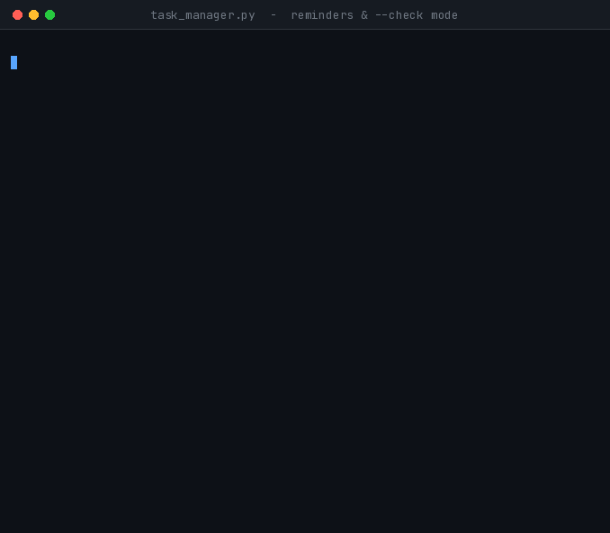

<div align="center">

# 🔔 Task 5 — Persistent Task Manager + Reminders

**Cognifyz Technologies · Software Development Internship · Level 3**


A single JSON file that persists tasks across runs.
Every launch produces a briefing: **what is overdue, what is due today,
what is coming up, and what has changed since the last visit.**

</div>

> The program does not perform tasks on your behalf. It **reminds** — what to do, by when, and which deadlines have already passed.

---

## 🚀 Run

```bash
python task5_task_manager_persistent/task_manager.py
```

Briefing only, no interactive app:

```bash
python task5_task_manager_persistent/task_manager.py --check
```

---

## 🎬 Briefing + automation

<div align="center">



*App launches with a briefing → one task marked done → then `--check` mode, the entry point Task Scheduler invokes daily*

</div>

The briefing looks like this:

```
==============================================================
  TODAY'S BRIEFING  -  Wednesday, 19 August 2026
==============================================================

  Last visit: 2 days ago   (6 opens in total)

  !! OVERDUE (2)
     #1   Update the resume            High      4 days overdue
     #2   Submit the assignment        High      1 day overdue

  >> DUE TODAY (1)
     #3   Write the Task 5 README      High      due today

  .. NEXT 3 DAYS (1)
     #4   Renew gym membership         Medium    2 days ahead

  Since last visit: 1 became overdue, 1 completed, 1 created.

  Total 8 tasks | 7 pending | 1 done | 1 without a deadline
==============================================================
```

**The "since last visit" line is the heart of this task.** It is not read from a separate log file — the program computes it by comparing `meta.last_opened`, each task's `created_at`, and its `completed_at`.

---

## ⏰ Running it automatically on Windows

A Python script cannot **wake itself up** — it runs only when something invokes it. True automation is delegated to Windows Task Scheduler:

1. Open **Task Scheduler** from the Start menu.
2. **Create Basic Task** → give it a name, for example `Task reminders`.
3. Trigger: **When I log on** (or **Daily** at a chosen time).
4. Action: **Start a program**
   - Program: `python`
   - Arguments: `"C:\Users\...\task5_task_manager_persistent\task_manager.py" --check`
5. Finish.

The briefing will now appear every time you log in.

> The exact command can also be retrieved from within the program — option 9 (**File info**) prints the correct absolute path for your machine.

### Two design decisions in `--check` mode

**1. It does not touch `last_opened`.**
If it did, the daily Task Scheduler run would consume the "since last visit" delta itself, and you would never see it when you actually opened the app. `last_opened` is therefore only updated when **you** open the app interactively.

**2. It returns a meaningful exit code.**

| Code | Meaning |
|:---:|---|
| `0` | Nothing urgent |
| `1` | Something is overdue or due today |
| `2` | The store could not be opened |

This makes it easy to chain a batch script or notification — for example, `if errorlevel 1`.

---

## 📦 One canonical file — `tasks.json`

Settings, history and tasks all live in a single place.

```json
{
  "name": "Cognifyz Internship - Task 5 task store",
  "version": 2,
  "meta": {
    "created_at": "2026-08-01 09:00:00",
    "last_opened": "2026-08-17 10:12:30",
    "open_count": 6,
    "remind_before_days": 3
  },
  "tasks": [
    {
      "id": 1,
      "title": "Update the resume",
      "description": "for the placement portal",
      "priority": "High",
      "due_date": "2026-08-15",
      "status": "pending",
      "created_at": "2026-08-01 09:00:00",
      "completed_at": null
    }
  ]
}
```

In addition to Task 3's seven fields, each task now carries `completed_at`. Knowing a task is done was not enough — it also had to be clear **when** it was done. That is what enables the "1 completed since last visit" line.

`meta.remind_before_days` is configurable via menu option 8 — the reminder window can be widened to 7 days or set to 0 (show only overdue and due-today items).

---

## 🔁 Old data is preserved

An earlier version of the project stored data in `tasks.txt`. If that file exists, the program will, **on first run**:

1. Read `tasks.txt` (both the 7-field legacy format and the 8-field current one).
2. Migrate the data into `tasks.json`.
3. Rename the old file to `tasks.txt.migrated` — **never deleting it**.

Titles containing `|` with the correct escaping are migrated intact. The text export (menu option 7) is still available, including its escaping logic.

---

## 🛟 If the file becomes corrupt

<div align="center">


*JSON deliberately damaged → the program detects it, saves a backup, and starts cleanly*

</div>

1. The corrupt file is **preserved as** `tasks.json.bak` (never deleted).
2. The exact path of the backup is reported to the user.
3. The app starts with an empty list.

If a `.bak` already exists, the program creates `.bak.1`, `.bak.2`, etc. — no previous backup is ever overwritten.

---

<details>
<summary><b>🧪 Testing — 110/110 checks pass (click to expand)</b></summary>

| Group | What was checked |
|---|:---:|
| `completed_at` set by mark_done, cleared by mark_pending, does not shift on repeat done | ✅ |
| `to_dict` ↔ `from_dict` roundtrip; legacy 7-field dictionaries also load | ✅ |
| JSON store save / load; meta preserved; `\|`-containing titles handled correctly | ✅ |
| **Six flavours of corrupt JSON** — bad syntax, missing tasks list, top-level array, bad id, bad date, duplicate id | ✅ |
| For each case: backup created, content preserved, path reported in the message | ✅ |
| **Migration** — v1 (7 field) and v2 (8 field) lines both handled, including escaped `\|` | ✅ |
| After migration, the original file is renamed `.migrated`, not deleted | ✅ |
| **Briefing engine** — overdue / due today / inside window / outside window / no deadline all classified separately | ✅ |
| A done task past its deadline is never classified as overdue | ✅ |
| `newly_overdue` includes only items whose deadline expired after the last visit | ✅ |
| `completed_since` and `created_since` filter strictly to events after last visit | ✅ |
| Window clamping — `-5`, `0`, `999`, `"abc"`, `None`, `"7"` all handled correctly | ✅ |
| Exit code source — 1 for overdue or due today, 0 for future-only, 0 when a done task is past-due | ✅ |
| Text export roundtrip with `\|`, newline and backslash in titles | ✅ |
| Clean `StorageError` on a non-writable path | ✅ |
| `human_gap` — just now / minutes / hours / yesterday / days | ✅ |

</details>

<details>
<summary><b>🐛 A bug that testing caught</b></summary>

The text-export roundtrip test failed. The cause:

```python
data = {name: (value if value != "" else None) for name, value in zip(names, fields)}
```

Every empty field was being converted to `None`. But an empty **description** does not mean `None`; it means `""` — "empty" and "absent" are different things. When the data was reloaded, `description` came back as `None`.

The second half of the bug was related:

```python
description=data.get("description", "")
```

`get(key, default)` returns the default only when the **key is missing**. Here the key was present but the value was `None`, so `None` was returned.

**Fix:**

```python
nullable = ("due_date", "created_at", "completed_at")   # only these can legitimately be None
description=data.get("description") or ""               # coerce None to ""
```

**Lesson:** do not conflate `None` with `""`. And `dict.get(key, default)` handles missing keys, not `None` values.

</details>

<details>
<summary><b>⚙️ Design decisions</b></summary>

- **JSON as the primary store** — the file no longer contains only tasks; it also carries `meta` (last opened, settings, count). Nested data of that shape does not fit a one-line-per-task text format cleanly. JSON is still a plain text file — it opens in any editor.
- **Text export retained** — the brief requires a `"text file"`, and the escaping code should not go to waste. Menu option 7 produces it.
- **Single source of truth** — writing to two files simultaneously seems easy but produces the worst class of bug when the files drift. `tasks.json` is authoritative.
- **`--check` is read-only** — automation must not consume the user's history.
- **`meta` embedded in the file** — a separate config file would require two files to stay in sync. One file, one truth.
- **Briefing computation in `build_briefing()`, presentation in `render_briefing()`** — the compute layer can be unit-tested without any I/O. 25 of the 110 checks target that single function directly.
- **Corrupt file is never deleted — always `.bak`** — the user's data belongs to the user.
- **`os.replace`, not `os.rename`** — on Windows, `rename` fails when the destination already exists.

</details>

<details>
<summary><b>📂 Runtime files (git-ignored)</b></summary>

```
tasks.json           <- your data
tasks.txt            <- text export (option 7)
tasks.json.bak       <- backup of a corrupt file, if any
tasks.txt.migrated   <- pre-migration copy of the old format
```

All of the above are covered by `.gitignore` — these are generated data, not source.

</details>

---

## 📋 Menu

```
  1. Create a new task              5. Delete a task
  2. View tasks                     6. Show the briefing again
  3. Update a task                  7. Export to text file
  4. Mark a task as done            8. Reminder settings
                                    9. File info
  0. Exit
```

## 📁 Files

```
task5_task_manager_persistent/
├── README.md
├── task_manager.py
└── assets/
    ├── briefing_demo.gif
    └── recovery_demo.gif
```

<div align="center">

**Arghya Mahajan** · [github.com/15Arghya2004](https://github.com/15Arghya2004)

</div>
