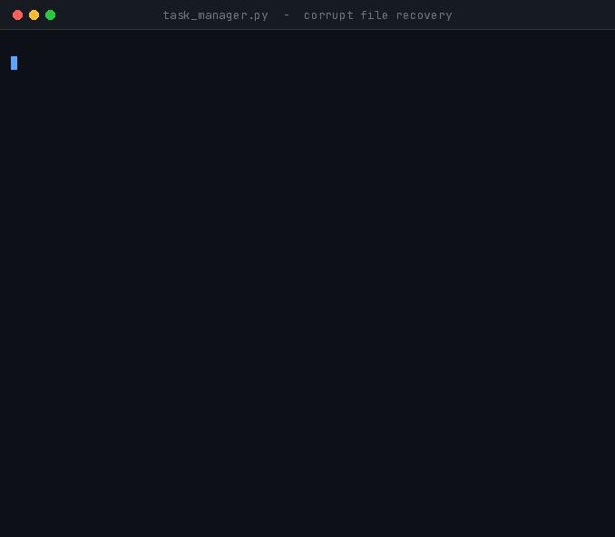

<div align="center">

# 💾 Task 5 — Persistent Task Manager

**Cognifyz Technologies · Software Development Internship · Level 3**


Task 3 wala task manager — **ab data file mein save hota hai.**
Program band karo, dobara kholo, tasks wapas mil jaate hain.

</div>

---

## 🚀 Chalao

```bash
python task5_task_manager_persistent/task_manager.py
```

Bas. Na install, na setup. File apne aap ban jaati hai.

---

## 🎬 Data restart ke baad bhi zinda rehta hai

<div align="center">


*Do task banaye → program band → **dobara chalaya** → dono wapas mil gaye → ek done kiya → JSON export*

</div>

> Ye GIF **do alag runs** ko jodkar banaya gaya hai. Beech wali `$ python task_manager.py` line wahin hai jahan program dobara chala.

---

## 🆕 Task 3 se kya alag hai

| | Task 3 | Task 5 |
|---|---|---|
| Data kahan rehta hai | sirf memory mein | `tasks.txt` file mein |
| Program band karne par | sab gayab | sab bacha rehta hai |
| Save kab hota hai | — | har badlaav ke turant baad, apne aap |
| Extra options | — | JSON export, file ki jaankari |

**`Task` class bilkul nahi badli.** Task 3 mein maine `to_dict()` aur `from_dict()` pehle hi bana diye the — Task 5 mein sirf save/load ka layer upar se juda hai. Jo README mein likha tha, wahi hua.

---

## 📄 File kaisi dikhti hai

`tasks.txt` ek saada text file hai — notepad mein khol ke padh sakte ho:

```
# Cognifyz Internship - Task 5 data file
# version 1
# id|title|description|priority|due_date|status|created_at
# '#' se shuru hone wali lines comment hain.
1|Task 5 ka README likho|GIF bhi banana hai \| phir push|High|2026-08-24|pending|2026-08-19 22:00:04
2|Gym jao||Low||pending|2026-08-19 22:00:04
```

Ek line = ek task. Fields `|` se alag.

Dhyaan se dekho pehli line mein: **`\|`** — wahi is task ka sabse important hissa hai.

---

## ⚠️ Sabse bada bug jo hone se roka gaya

Sochne mein file likhna aasaan lagta hai:

```python
line = "|".join([str(task.id), task.title, task.description, ...])
```

Aur padhna bhi:

```python
fields = line.split("|")
```

**Ye galat hai.** Agar user ne title hi aisa likh diya:

```
GIF bhi banana hai | phir push
```

To file mein ek extra `|` chala jayega. Load karte waqt `split("|")` 7 ki jagah **8 fields** dega, saara data ek khaana khisak jayega, aur `description` mein title ka aadha hissa aa jayega. Program crash bhi nahi karega — bas **chupchaap galat data** dikhata rahega. Yahi sabse khatarnaak kism ka bug hai.

### Solution: escaping

Likhte waqt khatarnaak characters badal do, padhte waqt wapas asli bana do:

| Asli | File mein |
|:---:|:---:|
| `\` | `\\` |
| `|` | `\|` |
| newline | `\n` |
| carriage return | `\r` |

```python
def escape(text):
    text = text.replace("\\", "\\\\")     # sabse pehle backslash
    text = text.replace("|", "\\|")
    text = text.replace("\n", "\\n")
    text = text.replace("\r", "\\r")
    return text
```

> **Backslash sabse pehle kyun?** Agar `|` pehle badalte to wo `\|` ban jaata, aur uske baad backslash wala step usi naye backslash ko dobara badal deta — `\\|`. Padhte waqt sab bigad jaata. **Escape character ko hamesha sabse pehle escape karo.**

Aur padhte waqt `split("|")` kaafi nahi — usse `\|` bhi separator lagta hai. Isliye ek chhota splitter likha jo **sirf un `|` par todta hai jo escape nahi hue**:

```python
if char == "\\" and index + 1 < len(line):
    current.append(char)
    current.append(line[index + 1])    # escape pair ko saath rakho
    index += 2
    continue
if char == SEPARATOR:
    fields.append("".join(current))    # yahi asli separator hai
```

Test mein `|`, `\`, newline, aur Hindi text — sab file se wapas bilkul waise hi nikalte hain.

---

## 🛟 File kharab ho jaye to?

<div align="center">



*File ko jaan-boojh kar bigaada → program ne pakad liya, backup banaya, aur chalta raha*

</div>

Program **teen kaam** karta hai:

1. Kharab file ko `tasks.txt.bak` naam se **bacha leta hai** (kabhi delete nahi karta)
2. Exact path bata deta hai kahan bachayi hai
3. Khaali list se shuru ho jaata hai — taki app khule to sahi

```
File kharab thi (line 5 padhi nahi ja saki (7 fields chahiye the, 8 mile)).
  Purani file yahan bacha di gayi hai:
    .../task5_task_manager_persistent/tasks.txt.bak
  Khaali list se shuru kar rahe hain.
```

Agar `.bak` pehle se maujood ho to `.bak.1`, `.bak.2` banti hai — **purana backup kabhi overwrite nahi hota.**

---

## 🔒 Atomic write — save karte waqt crash ho jaye to?

Seedha original file par likhna khatarnaak hai. Agar beech mein power chali gayi, to aadhi likhi file bachti hai **aur purana data bhi chala jaata hai.**

Isliye:

```python
temp = path + ".tmp"
with open(temp, "w", encoding="utf-8") as handle:
    ...poori file likho...
os.replace(temp, path)      # ye ek hi step mein hota hai
```

`os.replace` atomic hai — file ya to **poori purani** rehti hai ya **poori nayi**. Beech ki koi halat hoti hi nahi. Ek line ka kaam, par production mein isi se data bachta hai.

---

<details>
<summary><b>🧪 Testing — 89/89 checks pass (click karo)</b></summary>

PDF ka step 3 kehta hai *"Test the persistence of task data."*

| Group | Kya check kiya |
|---|:---:|
| escape/unescape — 15 nasty strings (`\|`, `\`, `\|\|\|`, newline, Hindi, khaali) | ✅ |
| Escape ke baad file mein koi bare `\|` ya newline bacha hi nahi | ✅ |
| `split_fields` escaped `\|` par nahi todta — **aur naive `split()` galat hota, wo bhi prove kiya** | ✅ |
| Task → line → Task, saare 7 fields wapas | ✅ |
| Disk par save → load, teen tasks bilkul same | ✅ |
| **Simulated restart** — banao/save/load/edit/save/load, 5 baar | ✅ |
| Delete ke baad reload par bhi ID reuse nahi hota | ✅ |
| File missing → khaali list + friendly message, koi crash nahi | ✅ |
| Corrupt file ke **5 alag tareeke** — kam fields, galat date, galat id, duplicate id, galat timestamp | ✅ |
| Har case mein: backup bana, content bacha, message mein path aaya | ✅ |
| Doosri baar corrupt hone par `.bak.1` bana, pehla backup salamat | ✅ |
| Comment aur khaali lines ignore hoti hain | ✅ |
| `.tmp` file save ke baad bachti nahi | ✅ |
| Na likhne laayak path par saaf `StorageError`, raw traceback nahi | ✅ |
| JSON export valid, `\|` aur newline usme bhi survive karte hain | ✅ |
| Hindi text file se wapas bilkul same | ✅ |
| Khaali list bhi save/load hoti hai | ✅ |

</details>

<details>
<summary><b>⚙️ Design decisions</b></summary>

- **Text file, JSON nahi** — PDF `"a text file"` maangta hai, to primary storage plain text hai. JSON sirf **export** (option 6) hai, kyunki wo doosre tools mein le jaane ke kaam aata hai.
- **Har badlaav par turant save** — alag "Save" button nahi rakha. "Save karna bhool gaya" wala bug hone hi nahi diya.
- **Save fail ho to saaf batao** — program keh deta hai ki badlaav sirf memory mein hai. Chupchaap nigalna sabse bura hota.
- **Corrupt file delete kabhi nahi** — hamesha `.bak` mein bachti hai. User ka data user ka hai.
- **File mein header comments** — koi bhi file khole to samajh aa jaye ki kaun sa field kaunsa hai. `version` line isliye taaki aage format badle to pata chal sake.
- **Duplicate ID ko corruption maana** — kyunki `next_id()` `max + 1` par chalta hai, do same ID hone ka matlab file bahar se chhedi gayi hai.
- **`os.replace`, `os.rename` nahi** — Windows par `rename` maujood file ke upar fail ho jaata hai, `replace` nahi.

</details>

<details>
<summary><b>📂 Runtime files (git mein nahi jaati)</b></summary>

```
tasks.txt        <- tumhara data
tasks.json       <- export (option 6)
tasks.txt.bak    <- corrupt file ka backup, agar kabhi bana
```

Ye teenon `.gitignore` mein hain — ye **generated data** hai, source code nahi.

</details>

---

## 📁 Files

```
task5_task_manager_persistent/
├── README.md
├── task_manager.py            <- poora program
└── assets/
    ├── persistence_demo.gif
    └── recovery_demo.gif
```

<div align="center">

**Arghya Mahajan** · [github.com/15Arghya2004](https://github.com/15Arghya2004)

</div>
