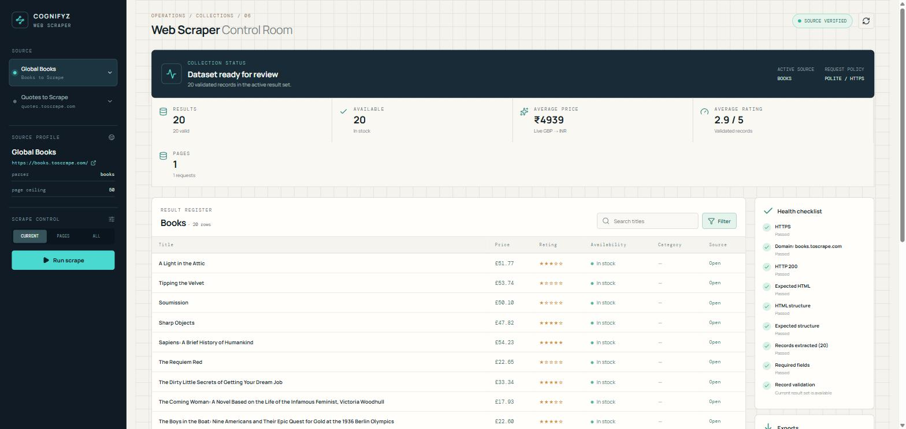
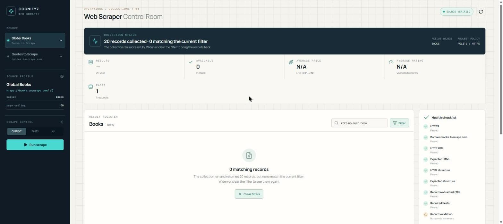

<div align="center">

# 🕸️ Task 6 — Interactive Web Scraper

**Cognifyz Technologies · Software Development Internship · Level 3**


A real web scraper — **runnable from the terminal and from a browser dashboard.**
Scraping is done with `requests` + `BeautifulSoup`. No API shortcuts.

</div>

---

## 🚀 Quick Start

**1. Python dependencies:**

```bash
pip install -r task6_web_scraper/requirements.txt
```

**2. Dashboard dependencies:**

```bash
cd task6_web_scraper/frontend
npm install
```

**3. Run — one command:**

```powershell
.\task6_web_scraper\run.ps1        # Windows
```

```bash
./task6_web_scraper/run.sh         # Linux / macOS
```

The backend runs on `http://localhost:8000` and the dashboard on `http://localhost:5173`.

**Terminal only? The dashboard is not required:**

```bash
python task6_web_scraper/book_scraper.py
```

---

## 🖥️ Dashboard

<div align="center">



*20 records collected from Books to Scrape — with live GBP → INR conversion*

</div>

The workflow is linear, and the user is not required to understand `requests`, `BeautifulSoup` or FastAPI:

```
Pick source  →  Verify health  →  Scrape  →  Results  →  Filter  →  Export
```

| Panel | Purpose |
|---|---|
| **Source rail** | Choose Books or Quotes — switching clears the previous dataset |
| **Health checklist** | HTTPS, domain, HTTP status, HTML structure, records extracted, required fields — each step reported separately |
| **Scrape control** | `CURRENT` (one page) · `PAGES` (a chosen count) · `ALL` (bounded by a safety limit) |
| **Result register** | Source-aware table — Books shows price / rating / stock; Quotes shows author / tags |
| **Filters** | Title / quote search, max price, min rating, category, in-stock only, author, tag |
| **Exports** | CSV · JSON · PDF — always on the **currently filtered set** |
| **Structure probe** | For any safe HTTPS page, reports headings, links, forms and tables |

---

## 🌐 Supported Sources

| Source | URL | Fields | Page ceiling |
|---|---|---|:---:|
| Books to Scrape | `https://books.toscrape.com/` | title, price, rating, availability, URL, category | 50 |
| Quotes to Scrape | `https://quotes.toscrape.com/` | quote, author, tags, author URL | 10 |

Both sites are **built specifically for scraping practice** — neither `robots.txt` blocks any page.

> **An honest disclaimer:** Books to Scrape is a global practice catalogue, not an Indian book catalogue. No verified Indian source was available, so no Indian book or INR price is **fabricated**. What is here is what is real.

A source is considered **verified** only when every health step passes **in the current run**. Selecting a source does not mark it verified, and verification is re-run before every scrape.

---

## 🔒 Safety

The scraper deliberately restricts what it will do:

| Control | What it prevents |
|---|---|
| HTTPS-only | plain HTTP requests |
| Domain allowlist | any host outside the registered sources |
| Reject localhost / loopback | `localhost`, `127.0.0.1`, `::1` |
| Reject private / link-local / reserved IPs | internal network reconnaissance |
| DNS resolution check | hostnames that resolve to internal addresses |
| **Redirect validation** | the **final URL** after redirects must also pass every rule |
| Timeout · retries · backoff | 20s timeout, 2 retries, increasing gap |
| Request delay | 1-second gap between requests — no load on the target server |
| Safe download path | export files served only from the exports directory |

Errors are surfaced to the user as **readable messages** — never as a raw Python traceback.

---

## 💱 Currency

Book prices are **kept in GBP** (the source publishes them in GBP), and each row displays a live INR value alongside. The rate comes from [Frankfurter](https://www.frankfurter.app/); nothing is hard-coded.

- The rate is fetched once and cached.
- On failure, retry is attempted with a 5-minute cooldown.
- If no rate can ever be obtained, the dashboard displays **"INR conversion unavailable"** — no fabricated number.

*Observed during a live run:* `£51.77 → ₹6720.26`, i.e. `1 GBP ≈ ₹129.81`.

---

## 📤 Exports

Output files are written to `task6_web_scraper/exports/`.

| Format | Content |
|---|---|
| **CSV** | flat, machine-readable — `title, price_inr, price, original_currency, rating, availability, category, url` |
| **JSON** | structured report — `{ report, statistics, results }` |
| **PDF** | professional report — summary metrics, results table, repeating headers, timestamps, page numbers |

All three operate on the **current filtered result set**, not on the raw dataset.

---

## 🧪 Testing

```bash
python -m unittest discover -s task6_web_scraper/tests -v
python -m py_compile task6_web_scraper/book_scraper.py
python -m py_compile task6_web_scraper/api.py
```

```
Ran 38 tests
OK
```

Every test runs **offline** — HTML fixtures and mocks, no internet required.

<details>
<summary><b>Coverage across the 38 tests</b></summary>

| Group | Coverage |
|---|---|
| Parsing | Books and Quotes fields, relative → absolute URLs, pagination, empty HTML |
| Validation | required fields, invalid records, empty source health failure |
| URL safety | HTTPS-only, domain allowlist, localhost, loopback, private IP |
| Fetch | HTML result + request counting, **redirect to a different domain rejected**, same-domain redirect allowed |
| Input | non-finite values (`nan`, `inf`, `-inf`) rejected |
| Export | CSV / JSON content, directory auto-creation |
| Source state | switching a source clears results and stats; a failed health resets verification |
| **API contract** | currency enrichment, JSON / PDF export shape, source-switch isolation |
| **Regressions** | results-before-scrape, zero-match filter, clear-filters recovery, export messages, FX retry |

</details>

---

## 🔌 API Contract

The dashboard does not scrape on its own — every operation goes through this API, and the API wraps the same `book_scraper.py` engine.

| Method | Endpoint | Purpose |
|---|---|---|
| `GET` | `/api/health` | service liveness |
| `GET` | `/api/sources` | source list + currently selected source |
| `POST` | `/api/sources/{id}/verify` | run health checks and return step-by-step results |
| `POST` | `/api/scrape` | scrape in `current` / `custom` / `all` mode |
| `POST` | `/api/filter` | in-memory filter against the scraped dataset |
| `GET` | `/api/results` | current result set |
| `POST` | `/api/probe` | structural summary of any safe HTTPS page |
| `POST` | `/api/export` | produce CSV / JSON / PDF |
| `GET` | `/api/download/{filename}` | serve an export file securely |

Every endpoint **always returns valid JSON** — on both success and error paths. Errors are accompanied by a readable message.

---

<details>
<summary><b>🐛 Real bugs found and fixed (click to expand)</b></summary>

This section captures the highest-value learning from the project. Each bug was real, reproducible, and covered by a regression test.

### 1. Redirect target was not being re-validated — *security*

The original code validated the URL **before** the request, but did not check the **final URL** after redirects. That allowed the sequence: allowed source → redirect → external domain, with the redirected response being parsed silently.

**Fix:** `response.url` is now put through the same safety system. Same-domain redirects are allowed; cross-domain redirects are rejected.

### 2. `"Unexpected end of JSON input"` — *frontend contract*

The dashboard displayed this error on startup. The shared frontend helper looked like:

```ts
const data = await response.json();          // parse first
if (!response.ok) throw new Error(...);      // then check status
```

When the backend is down, the **Vite proxy returns `HTTP 502` with a 0-byte body** (measured and confirmed). Calling `.json()` on an empty body throws `SyntaxError`, and the real 502 is lost.

**Fix:** read the body as text first, parse JSON only when the body is non-empty, and surface the backend's own message on non-OK responses. The user now sees:

> *"Backend unavailable. Make sure the scraper API is running on port 8000."*

### 3. Filter to zero results left the user stuck

If a filter matched nothing, the backend cleared `LAST_RESULTS`, and the guard `if not LAST_RESULTS` fired. The result was that **"Clear filters" itself returned 409** — *"Scrape results before filtering."* The user was forced to re-scrape.

**Fix — the invariant was made explicit:**

```
_base_results  =  what was scraped (never mutated)
LAST_RESULTS   =  what is currently displayed (mutated by filter)
```

"Has anything been scraped?" is now asked against `_base_results`. Export raises two distinct messages — *"scrape a source first"* and *"the filter matches nothing"*.

Live testing revealed **the other half of the same bug**: every frontend filter control was gated on `disabled={!records.length}`, so once a filter matched zero rows, the search box, Filter, Apply and Clear controls all went dead. The invariant was applied on the frontend too (`disabled={!stats}`).

<div align="center">



*Zero-match now has its own explicit state — "20 records collected · 0 matching the current filter" — and Clear filters remains functional*

</div>

### 4. Exchange rate could go permanently disabled after one failure

The `attempted` flag was set **before** the request and never cleared on failure. A single network blip disabled INR conversion for the rest of the process.

**Fix:** the cache holds successful rates only; on failure, a fresh attempt is made after a 5-minute cooldown.

### 5. An old backend silently served the frontend

If port 8000 was already occupied, the new uvicorn bind failed (with the error in its own window), and Vite continued talking to the **stale** backend using the older API contract.

**Fix:** `run.ps1` and `run.sh` now check **both 8000 and 5173**, report the PID, and refuse to start:

```
Port 8000 is already in use, so the backend (uvicorn) cannot start cleanly.
  Held by PID 6328 (python3)
  Stop it with:  kill 6328

Startup cancelled so the dashboard does not attach to an old backend.
```

### 6. Empty description became `None` in text export

`value if value != "" else None` converted every empty field to `None`. But an empty **description** does not mean `None`; it means `""`. And `data.get("description", "")` compounded the problem — `get` only returns the default when the **key is missing**, not when the value is `None`.

**Lesson:** `None` and `""` are not interchangeable.

</details>

<details>
<summary><b>⚙️ Design decisions</b></summary>

- **One readable file for the scraper engine** — no manager class, adapter framework or factory pattern. The flow reads top-to-bottom: constants → model → fetching → parsing → display → actions → menu.
- **The API wraps the scraper; it does not re-implement it.** No scraping logic exists in React.
- **The CLI is not deprecated.** The dashboard does not replace it — both run on the same engine.
- **Verification runs before every scrape.** If the site's structure changes, scraping does not start.
- **Filtering is server-side, on the scraped dataset** — no new request is issued and the target server is not re-hit.
- **Statistics are real** — pages, HTTP requests, valid / invalid records, elapsed time. No fabricated metric.

</details>

---

## 📁 Files

```
task6_web_scraper/
├── README.md
├── requirements.txt
├── book_scraper.py            <- scraping engine + CLI (source of truth)
├── api.py                     <- FastAPI wrapper around the engine
├── run.ps1 / run.sh           <- one-command startup, with port guards
├── assets/                    <- dashboard screenshots
├── exports/                   <- generated CSV/JSON/PDF (git-ignored)
├── tests/
│   ├── test_scraper.py
│   └── test_api.py
└── frontend/
    ├── package.json
    ├── vite.config.ts         <- proxies /api to port 8000
    └── src/
        ├── main.tsx           <- the whole dashboard
        └── styles.css
```

---

## ⚠️ Limitations

- Only the two registered sources are fully supported. Custom URLs are limited to **safe structure probing**; automatic scraping of arbitrary sites is not offered.
- No database, no cache, no concurrency — a deliberate scope decision for an internship task.
- If either practice site's HTML changes, the parser will need to be updated. The health check will surface that case.
- Server-side state is single-process — one result set is shared across all browser tabs.

<div align="center">

**Arghya Mahajan** · [github.com/15Arghya2004](https://github.com/15Arghya2004)

</div>
